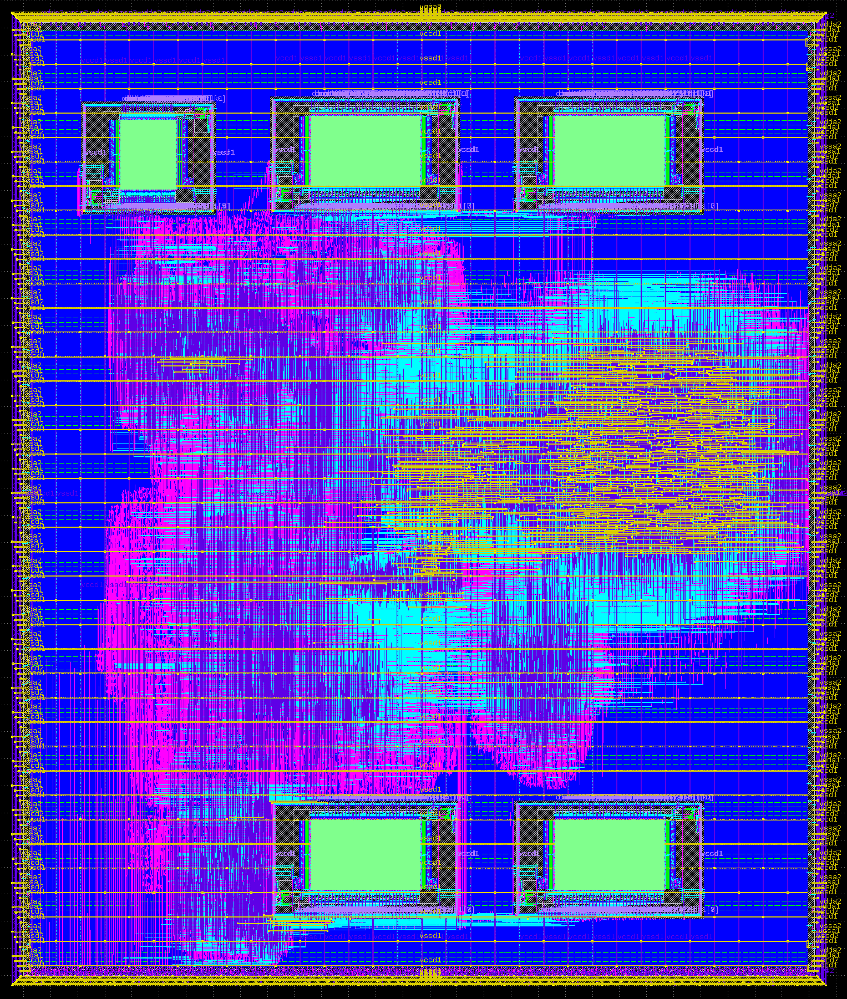

# Caravel User Project

  

| :exclamation: Important Note            |
|-----------------------------------------|
This project demonstrates an customized TinyRocket with SHA3 SoC, generated from Chipyard. The SoC is implemented in Sky130nm using the Openlane flow.

  

